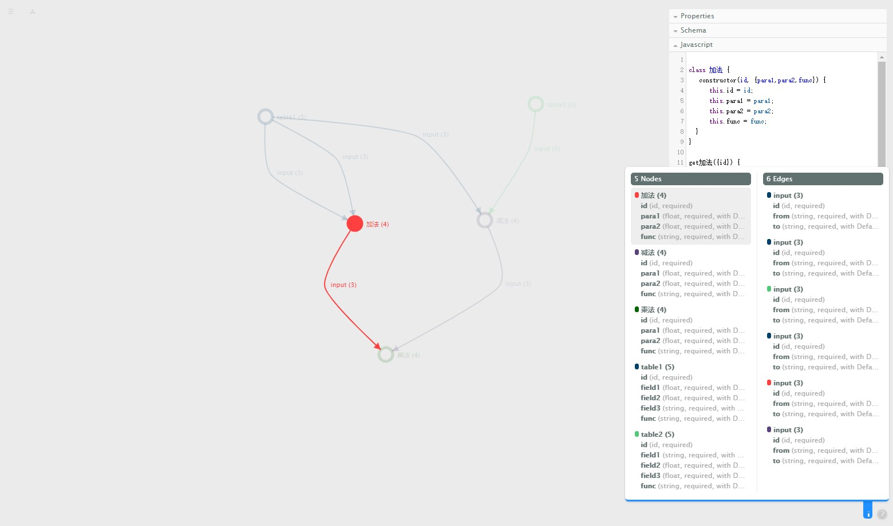

# ongdb-graphene
>ONgDB GRAPHENE

>前后端分离项目：启动时分别启动后端接口服务、前端可视化服务

## introduction
>图数据模型设计工具



## 一、前端【browser:browser】
```
unzip -d ./ongdb-graphene-browser/ ongdb-graphene-browser.zip
```
1. git clone https://github.com/ongdb-contrib/ongdb-graphene.git
2. cd ongdb-graphene/browser
3. npm install
4. npm start
5. open http://localhost:8080/app/

### Dockerfile
- 在ongdb-graphene/browser目录下创建Dockerfile文件，打包前端docker镜像即可
```
FROM centos
USER root
WORKDIR /app
ADD . /app/
RUN yum install -y npm maven
RUN npm install -g cnpm -registry=https://registry.npm.taobao.org
RUN npm install webpack@4.46.0 webpack-cli@3.3.12 webpack-dev-server@3.11.0 -g
RUN cnpm install clean-webpack-plugin@3.0.0 \
                 css-loader@3.6.0 \
                 file-loader@6.0.0 \
                 html-loader@1.1.0 \
                 html-webpack-harddisk-plugin@1.0.2 \
                 html-webpack-plugin@4.5.2 \
                 mini-css-extract-plugin@0.9.0 \
                 node-sass@4.14.1 \
                 optimize-css-assets-webpack-plugin@5.0.3 \
                 sass-loader@9.0.2 \
                 style-loader@1.2.1 \
                 url-loader@4.1.0 \
                 copy-webpack-plugin@6.2.1 \
                 glob@7.1.6 jquery@3.5.1
WORKDIR /app/browser
#CMD ["cnpm","install"]
#ENTRYPOINT ["cnpm", "start"]
```
- 打包
```
sudo docker build -t ongdb-graphene-browser:v-1.0.0 .
```
- 启动
```
sudo docker run -p 8080:8080 ongdb-graphene-browser:v-1.0.0 bash -c "cnpm install && cnpm start"
```

## 二、后端【backend:ongdb-graphene】
- 启动类
```
data.lab.ongdb.RestApiEntrance
```
- 启动脚本
[start.sh](ongdb-graphene/start.sh)

- 前端代理数据接口
```
http://localhost:8081/ongdb-graphene/
https://localhost:8082/ongdb-graphene/
```
- api-docs
```
http://localhost:8081/ongdb-graphene/v2/api-docs
https://localhost:8082/ongdb-graphene/v2/api-docs
http://localhost:8081/ongdb-graphene/swagger-ui.html
https://localhost:8082/ongdb-graphene/swagger-ui.html
```
