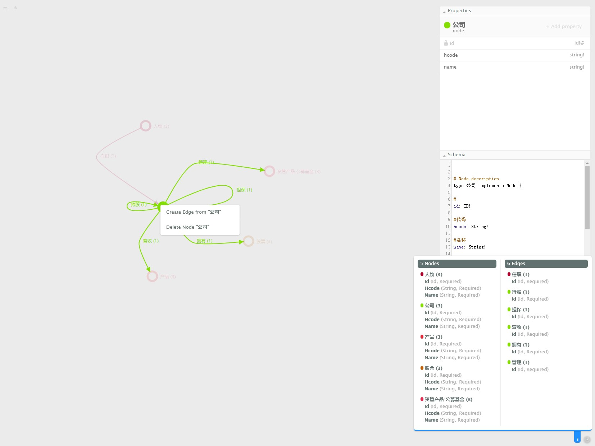

# ongdb-graphene
>ONgDB GRAPHENE

## 后端【backend:ongdb-graphene】
- 启动类
```
data.lab.ongdb.RestApiEntrance
```
- 前端代理数据接口
```
http://localhost:8081/ongdb-graphene/
https://localhost:8082/ongdb-graphene
```

## 前端【browser:browser】
1. git clone https://github.com/ongdb-contrib/ongdb-graphene.git
2. cd ongdb-graphene
3. npm install
4. npm start
5. open http://localhost:8080/app/

## introduction
>图数据模型设计工具




